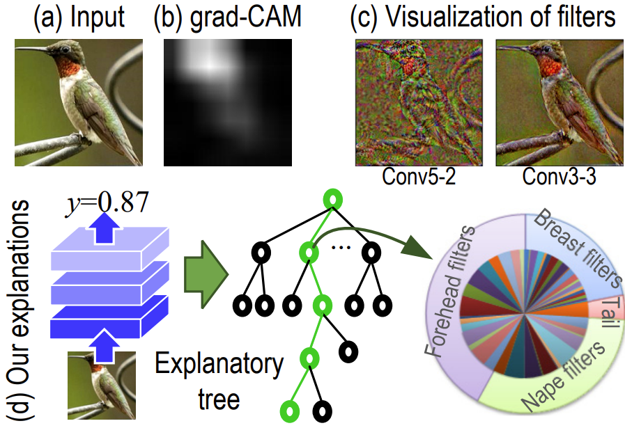

Final project of the Neural Networks course based on the work [Interpreting CNNs via Decision Trees](https://arxiv.org/abs/1802.00121).
Convolutional neural networks are nowadays widely used for different tasks in many fields, becomes thus important to understand what knowledge a CNN learns. 
In order to do so we have modified a VGG-16 network by adding a special mask layer at the end of the convolution, and trained it for an image classification task. 
Finally we have built a decision tree that could help us explain which object parts contributed the most to the final prediction and quantify these contributions 



