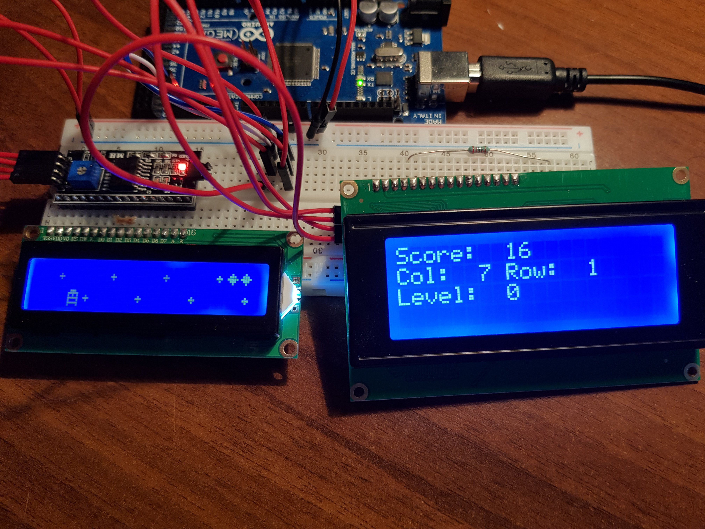

# i2c custom driver
Final project for the Operating Systems 2018/2019 course of prof. Giorgio Grisetti held at Sapienza.

<p class="text-center">

</p>

# What
Implementation of custom `i2c` drivers for *Master/Slave* the communication between an `Arduino` and a generic `i2c device`.

We coded two versions:
1. `i2c/basic`: i2c communication standard primitives.
    To test these drivers, two *Master/Slave* test mains were made between two different ATMegas *(code available in the `examples/[master/slave] folder)`*.

2. `i2c/interrupt`: i2c driver made with Interrupt and used in the upper layer `comunication.h` to enable **Multi-Slave** communication.

In addition, the driver for a **LCD device** was realized using the underlying `comunication.h` layer.
The driver allows:
- managing different displays (tested 16x2 and 20x4)
- screen shifting
- custom character creation

As an example of how the serial communication and i2c driver works, we made a video game _"loosely inspired"_ by Pacman.


| Master/Slave - 1 : 1| Master/Slave - 1 : n |
|--------------|---------------|
|              | my_lcd_i2c    |
|              | comunication  |
| i2c/basic    | i2c/interrupt |



# How
Initially, to fully understand how the protocol works, we implemented the `Basic` version.
Later, we realized the version with interrupts and with Multi-slave support (thus with address separation at both hardware and software levels).

We encountered many difficulties in the implementation of nonstandard communication in every piece of hardware, in particular:
- Arduino: reading by disabling interrupts in non-blocking mode 
- PC: Opening UART properly and defining primitives for communication
- Display: understanding of low-level screen operation, particularly shift

**N.B.** The screen is not totally refreshed each time (due to time issues) and a full shift is made to the display.
However, the display does not keep an absolute reference of the columns, but changes them with each shift. *(Ex. column 3 moves with each shift.)*


# How to Run
First, compile:
- `pc_server`
- `arduino client`
and then:
```s
cd avr/arduino_client
make
make arduino_client.hex

cd ../../pc_server
make
./i2c_videogame 0 # 0 se device su ttyACMO, 1 se ttyACM1
```

Now the fun begins :smirk:

## How the game works
The game core is located on Arduino, while user input is handled by the PC keyboard.
The communication between Arduino and PC is done via serial port.

Here are the various steps of the game:

1 - At startup the PC waits for the Arduino to be ready; once synchronized the words `start` will appear on both screens.

2 - Via keyboard the Player data (*name and desired difficulty*) is entered.

3 - Arduino is independent of the pc, so the game continues even if no keys are pressed on the keyboard. At each refresh step it sends a `life or death` message to the pc to communicate the status of the game.

4 - When the player dies the score is printed on both screens and Arduino remains waiting for a new game.

# Authors 
- Francesco Colasante
- Luca Gioffrè
- Gianmarco D'Alessandro
- Alessandro Accardo