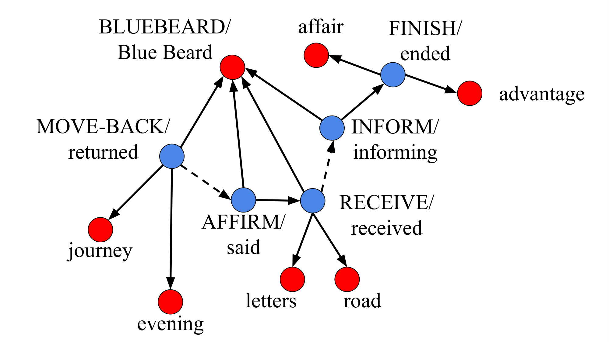

# SIR-Summ
SIR-Summ (*Structured Information Representation for Summarization*) is an **extractive summarizer of narrative short texts** (fairy tales and short stories) I developed for my master thesis project at Sapienza University of Rome, with Prof. Roberto Navigli as my advisor.
It was trained on the **FairySum** portion of the much larger Echoes from Alexandria dataset\[1\].

The main idea was to leverage (i) the semantics of the text using SRL, (ii) the entity information obtained by a coreference pipeline, and (iii) grammatics retrieved by depencency parsing.
With these information, it is possible to build a graph for each story, on which a GNN-based classfier can be trained to select the *important sentence*, so to output an extractive summary of the story in input.

\[1\]: [Echoes from Alexandria: A Large Resource for Multilingual Book Summarization (Scirè et al., Findings 2023)](https://aclanthology.org/2023.findings-acl.54/)